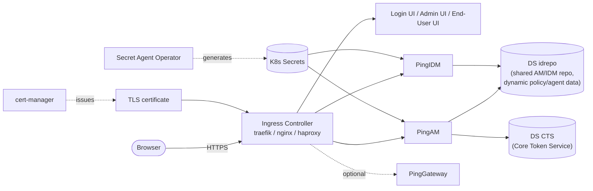
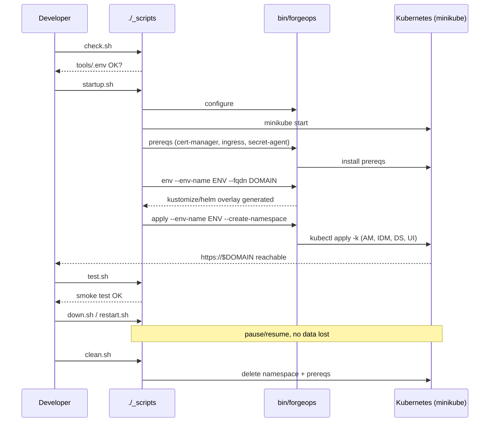

# Deploying with ForgeOps

_Kubernetes deployment for the Ping Advanced Identity Software._

This repository provides Docker, Kustomize and Helm artifacts as well as custom tooling to help users deploy the 
**Ping Advanced Identity Software** on a Kubernetes cluster. 

## Pre-release software 

The [main branch](https://github.com/ForgeRock/forgeops/tree/main) is where ForgeOps engineers work on bugs and new features for the next release.  Please feel free to try the latest features by checking out the [main branch](https://github.com/ForgeRock/forgeops/tree/main).  
Please find the *pre-release documentation* [here](https://staging-docs.pingidentity.com/forgeops/dev).
The *pre-release Release Notes* can be found [here](https://staging-docs.pingidentity.com/forgeops/dev/rn/rn.html).

>Note: The latest pre-release software in the dev branch is not supported by Ping Identity.

## What's new in the latest ForgeOps release?

See the [ForgeOps Release Notes](https://docs.pingidentity.com/forgeops/latest/rn/rn.html) to read about new features and changes.

## Ping Advanced Identity Software configuration

The default product configuration bundled with the product images is a basic installation that can be further extended by developers to meet their requirements. 
The main features of the default configuration are:

* Deployments for PingAM, PingIDM, PingDS and PingGateway. PingGateway is not deployed by default, but is available optionally.
* PingAM configured with a single root realm.
* A number of OIDC clients configured for PingAM/PingIDM integration and for smoke tests.
Note that the `idm-provisioning`, `idm-admin-ui` and the `end-user-ui` client configurations are required for the
integration of PingIDM and PingAM.
* Directory service instances configured for:
   * The shared PingAM/PingIDM repo (ds-idrepo).
   * The Ping dynamic runtime data store for policies and agents. Currently, ds-idrepo is used.
   * The Ping Core Token Service (ds-cts).

## Architecture

How the deployed components relate to each other:



## Getting Started

If you just want to observe the Ping Advanced Identity Software in action on a 
Kubernetes cluster, you can try out our ForgeOps deployment. You'll need to install 
the required third-party software, set up a Kubernetes cluster, and install the 
Ping Advanced Identity software. 

See the [Setup](https://docs.pingidentity.com/forgeops/latest/setup/overview.html) and [Deployment](https://docs.pingidentity.com/forgeops/latest/deploy/overview.html) sections in the documentation for detailed information about all these tasks.

There are two ways to bring the platform up locally: the automated scripts in
[`./_scripts`](_scripts/README.md) (recommended - handles minikube, prereqs and
the host-access proxy for you), or the `forgeops` CLI directly. Both are
documented below.

### Prerequisites

Install and have on `$PATH`: `docker`, `kubectl`, `helm`, `minikube`, `python3`
(3.9.6+). `./_scripts/check.sh` (or `make check`) verifies all of these and
tells you exactly what's missing.

<details>
<summary>Install commands by OS</summary>

#### Ubuntu / Debian

```bash
sudo apt-get update
sudo apt-get install -y build-essential curl python3 python3-venv python3-pip

# docker
curl -fsSL https://get.docker.com | sh
sudo usermod -aG docker "$USER"   # log out/in afterwards

# kubectl
curl -LO "https://dl.k8s.io/release/$(curl -L -s https://dl.k8s.io/release/stable.txt)/bin/linux/amd64/kubectl"
sudo install -o root -g root -m 0755 kubectl /usr/local/bin/kubectl

# helm
curl https://raw.githubusercontent.com/helm/helm/main/scripts/get-helm-3 | bash

# minikube
curl -LO https://storage.googleapis.com/minikube/releases/latest/minikube-linux-amd64
sudo install minikube-linux-amd64 /usr/local/bin/minikube
```

#### macOS (Homebrew)

```bash
brew install --cask docker
brew install kubectl helm minikube python3
```

`build-essential` isn't needed on macOS (Xcode command line tools cover it -
`xcode-select --install` if you've never run them).

</details>

### Option A - Quickstart with `./_scripts` (recommended for local dev)

```bash
cp .env.example .env          # edit ENV / K8S_NAMESPACE / K8S_SIZE / DOMAIN
./_scripts/check.sh           # or: make check
./_scripts/startup.sh         # or: make start
```

`startup.sh` is idempotent and does everything by itself: creates a Python
venv, runs `forgeops configure`, starts minikube, installs prereqs
(cert-manager/ingress/secret-agent), generates the environment, applies the
platform, and sets up host access to `https://$DOMAIN`. See
[`_scripts/README.md`](_scripts/README.md) for the full command list
(`test.sh`, `down.sh`, `restart.sh`, `clean.sh`, `admin-password.sh`) and the
equivalent `make` targets (`make help`).



### Option B - Manual setup (default `forgeops` CLI, no scripts)

This is what `./_scripts/startup.sh` automates above; useful if you want to
target a non-minikube cluster or need more control over each step.

```bash
python3 -m venv .venv && source .venv/bin/activate
./bin/forgeops configure

# any Kubernetes cluster works here; minikube shown as an example
minikube start --cpus 4 --memory 8000mb --disk-size 40g

./bin/forgeops prereqs

kubectl apply -f etc/resources/selfsigned-issuer.yaml
./bin/forgeops env --env-name demo --fqdn <your-domain> --namespace <your-namespace> \
  --cluster-issuer default-issuer --single-instance

./bin/forgeops apply --env-name demo --namespace <your-namespace> --create-namespace
```

## Accessing the UIs and APIs

See [UI and API access](https://docs.pingidentity.com/forgeops/latest/deploy/access.html) in the ForgeOps documentation.

Local dev via `./_scripts`: the `amAdmin` password isn't printed by
`startup.sh` (it's autogenerated by Secret Agent) - fetch it with:

```bash
./_scripts/admin-password.sh   # or: make admin-password
```

## Secrets

Ping Identity uses secrets generated by [Secret Agent Operator](https://github.com/ForgeRock/secret-agent).
 
## Troubleshooting Tips

See [Troubleshooting](https://docs.pingidentity.com/forgeops/latest/troubleshoot/overview.html) in the ForgeOps documentation.

## Cleaning up

See [Remove a ForgeOps deployment](https://docs.pingidentity.com/forgeops/latest/deploy/remove.html) in the ForgeOps documentation. 

Local dev via `./_scripts`:

```bash
./_scripts/down.sh    # or: make down     - pause (stop minikube), keep all data
./_scripts/clean.sh   # or: make clean    - delete the namespace + prereqs
./_scripts/clean.sh --full   # or: make clean ARGS=--full   - also delete the minikube profile
```

## Repository Layout

| Path | Contents |
| --- | --- |
| [`bin/`](bin) | The `forgeops` CLI and its subcommands |
| [`_scripts/`](_scripts) | Local dev workflow scripts wrapping `forgeops` for minikube (see [`_scripts/README.md`](_scripts/README.md)) |
| [`kustomize/`](kustomize) | Kustomize bases/overlays for each environment |
| [`helm/`](helm) | Helm values per environment |
| [`docker/`](docker) | Dockerfiles for custom images |
| [`etc/`](etc) | Supporting Kubernetes manifests (e.g. the self-signed issuer) |
| [`charts/`](charts) | Helm charts |
| [`how-tos/`](how-tos) | Task-oriented guides |
| [`legacy-docs/`](legacy-docs) | Older documentation kept for reference |

## References

[About the forgeops repositories](https://docs.pingidentity.com/forgeops/latest/start/repositories.html)

[Benchmark authentication rate](https://docs.pingidentity.com/forgeops/latest/prepare/benchmark/authrate.html)

[ForgeOps Release Notes](https://docs.pingidentity.com/forgeops/latest/rn/rn.html)

[The latest release branch](https://github.com/ForgeRock/forgeops)

[The latest release documentation](https://docs.pingidentity.com/forgeops/latest/index.html)

[Statement of support](https://docs.pingidentity.com/forgeops/latest/start/support.html#kubernetes-services)

[Troubleshooting](https://docs.pingidentity.com/forgeops/latest/troubleshoot/overview.html)

## License
This project is licensed under the CDDL License - see the [LICENSE](LICENSE) file for details
Copyright 2024 Ping Identity Corporation. All Rights Reserved.
